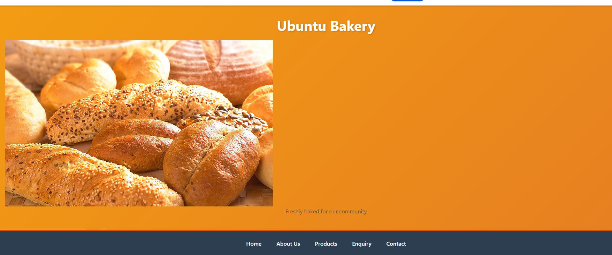
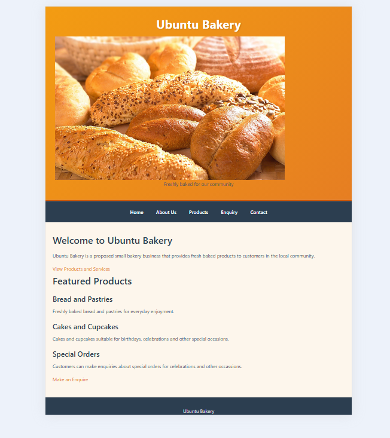
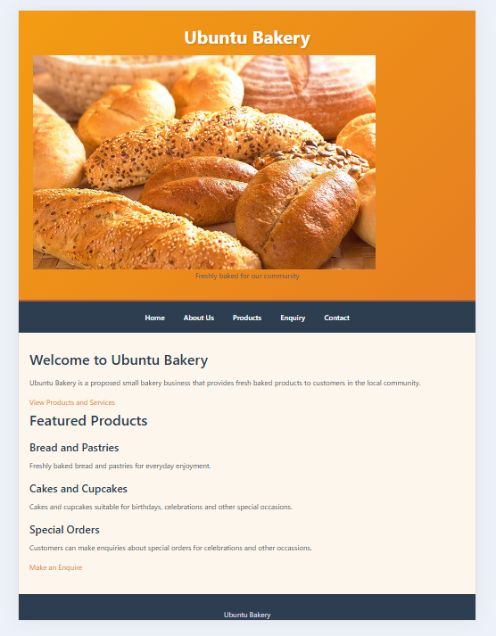

 Ubuntu Bakery Website

 Project Description

Ubuntu Bakery is a proposed small bakery business that provides freshly baked products to customers within the local community. The website has been developed to establish an online presence for the bakery and to make information about its products, services and contact details easily available to customers.

 Website Purpose

The main purpose of the Ubuntu Bakery website is to:

 Introduce the bakery to potential customers.
 Share information about the bakery.
 Showcase the bakery's products and services.
 Give customers an opportunity to make enquiries.
 Provide accessible contact information.
 Create a straightforward and user-friendly online platform.

 Website Pages

The website consists of five main pages:

 Page     File Name      Description 

Home    index.html        Introduces Ubuntu Bakery and displays featured products. 
About Us about.html      Gives background information about the bakery and includes its mission, vision and values. 
Products  products.html  Provides information about bread, pastries, cakes, cupcakes and special orders.
Enquiry  enquiry.html    Gives customers a way to submit questions or requests. 
Contact  contact.html    Provides the information customers need to get in touch with Ubuntu Bakery. 

 Project Structure

WEDE_POE_ST0481320
│
├── index.html
├── about.html
├── products.html
├── enquiry.html
├── contact.html
│
├── css/
│ └── style.css
│
├── images/
│ ├── bread.png
│ ├── cake.jpg
│ ├── cupcakes.jpg
│ ├── pastries.jpg
│ ├── special cake2.jpg
│ └── special-cake.jpg
│
├── Screenshot/
│ ├── desktop.png
│ ├── tablet.png
│ └── mobile.png
│
└── README.md

Technologies Used

HTML - Used to create and organise the webpage structure.
CSS - Used to style the pages and control their visual appearance.
Images - Used to display bakery products and make the website more visually appealing.
GitHub - Used for project version control and documentation.

Design Approach

The website follows a simple and organised design so that visitors can navigate between the different pages easily. A consistent navigation menu is included across the website. Bakery-related images are also used to support the website content and improve its visual presentation.

Responsive Design

The website is fully responsive and works on all screen sizes:

Desktop: 1200px and above
Tablet: 768px and below
Mobile: 480px and below

Current Features

Five connected webpages.
Navigation links between the pages.
Ubuntu Bakery branding.
Information about bakery products and services.
Images of bakery products.
Enquiry and contact sections.
 Consistent CSS styling.
Responsive design for different screen sizes.

 Future Improvements

 Adding more product images.
 Improving responsiveness.
 Introducing JavaScript functionality.
 Adding an online ordering system.

 Target Audience

The website is designed for local customers who are interested in bakery products and services. This includes customers looking for bread, pastries, cupcakes and cakes, as well as people who require special orders for celebrations and other occasions.

Sitemap

 HOME 
 (index)
     |
 
ABOUT │PRODUCTS │ ENQUIRY 
 US 
        |           

│ CONTACT │

 Screenshots

### Desktop View (1200px+)

### Tablet View (768px)

### Mobile View (480px)

## How to View the Website

1. Navigate to the project folder
2. Double-click `index.html`
3. The website will open in your default browser

Testing

Navigation Testing
 Link**  Destination Status

 Home  index.html   Working 
 About Us  about.html Working 
 Products  products.html Working
 Enquiry  enquiry.html Working
 Contact  contact.html, Working

 Responsive Testing
 Device  Breakpoint  Status 

Desktop 1200px-Working 
 Tablet  768px-Working 
 Mobile  480px-Working 

 Changelog

 Version 1.2 - CSS Styling and Responsive Design (Part 2)

Date:14 September 2026

Changes Made:

Created external stylesheet (style.css) and linked to all HTML pages
Added CSS reset for cross-browser consistency
Applied typography styles
Used CSS Grid and Flexbox for layout
Added visual styles: gradients, borders, box-shadows
Added hover and focus effects
Added breakpoints: 1200px, 768px, 480px
Implemented responsive design
Added comments to all HTML files
Fixed navigation type
Added screenshots folder

Version 1.1 - Initial Website Structure (Part 1)

Date: August 2026

Changes Made:
Created five HTML pages
Implemented consistent navigation
Added semantic HTML5 elements
Created folder structure
Created sitemap
 References

1. W3Schools. (2026). *CSS Tutorial*. https://www.w3schools.com/css/
2. MDN Web Docs. (2026). *CSS*. https://developer.mozilla.org/en-US/docs/Web/CSS
3. CSS-Tricks. (2026). *Flexbox Guide*. https://css-tricks.com/snippets/css/a-guide-to-flexbox/
4. CSS-Tricks. (2026). *Grid Guide*. https://css-tricks.com/snippets/css/complete-guide-grid/
5. Google Developers. (2026). *Responsive Web Design*. https://developers.google.com/web/fundamentals/design-and-ux/responsive
6. Visual Studio Code. (2026). https://code.visualstudio.com/
7. GitHub. (2026). https://docs.github.com/

Contact

Email: lebohangkatsana14@gmail.com
GitHub: [lebohang-katsana](https://github.com/lebohang-katsana)

 Conclusion

The Ubuntu Bakery website provides an online platform for presenting the bakery's products, services and business information. The project demonstrates the use of HTML, CSS, images, navigation and structured webpage content to create an organised website for a proposed local bakery.
